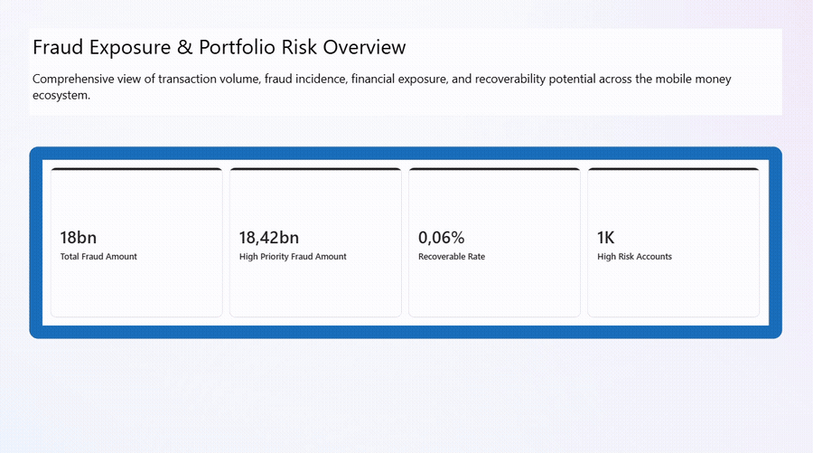

# Fraud Detection Analytics — SQL & Power BI

## Project Overview
This project analyses synthetic financial transaction data to identify behavioural patterns associated with fraudulent activity. The analysis focuses on detecting suspicious transaction trends, abnormal spending behaviour, and high-risk transaction patterns using SQL and Power BI.

The objective is to replicate real-world fraud analytics workflows used in financial institutions to support fraud monitoring and risk decision-making.

---

## Tools & Technologies


**Technologies Used**

- SQL (data extraction, joins, aggregations, analysis)
- Power BI (interactive dashboards and visual analytics)
- Synthetic financial transaction dataset

---

## Business Problem
Financial institutions process millions of transactions daily. Detecting suspicious behaviour early is critical for preventing financial losses and protecting customers.

This project explores how transaction data can be analysed to:

- Detect abnormal transaction behaviour
- Identify high-risk accounts
- Monitor suspicious transaction patterns
- Support fraud investigation workflows

---

## Analytical Objectives

- Analyse transaction behaviour across accounts
- Identify unusual transaction frequency and value anomalies
- Detect behavioural signals linked to potential fraud
- Create dashboards for fraud monitoring and investigation

---

## Data Preparation

Data preparation steps included:

- Cleaning and standardising raw transaction data
- Handling missing or inconsistent records
- Structuring the dataset for SQL analysis
- Creating derived metrics for fraud pattern analysis

---

## SQL Analysis

Key SQL techniques used:

- Common Table Expressions (CTEs)
- Window functions
- Transaction aggregation analysis
- Behavioural trend analysis
- Suspicious transaction identification queries

Example analysis performed:

- High-frequency transaction detection
- Abnormal transaction amount analysis
- Account-level transaction behaviour patterns

📂 **SQL File:**  
[`Fraud_Detection_Project.sql`](https://github.com/Llinvile/Fraud-Detection-Analytics-SQL-Power-BI/blob/main/Fraud%20Detection_SQL.sql)

---

## Power BI Dashboard

The Power BI dashboard provides an interactive view of fraud exposure, transaction behaviour, and high-risk account identification to support fraud investigation and decision-making.

### Dashboard Preview



### Key Insights

- 18bn total fraud exposure identified across transactions  
- 18.42bn classified as high-priority fraud  
- 1K high-risk accounts flagged for investigation  
- 0.06% recoverability rate indicating limited recovery potential  

### Dashboard Features

- Fraud exposure overview (KPIs)
- Fraud type analysis (CASH_OUT vs TRANSFER)
- Time-based fraud pattern analysis
- High-risk account ranking
- Data integrity and balance mismatch analysis

📊 **Power BI Dashboard File (PBIX)**  
Due to GitHub file size limitations, the full dashboard file is hosted externally.

**Includes:**
- 4 interactive dashboard pages  
- Fraud KPI monitoring  
- Risk-based account ranking  
- Time-based fraud analysis

[Download Power BI Dashboard](https://drive.google.com/file/d/1KwU5CEKqid5HwTnsXLSgW-VHdl4nahps/view?usp=sharing)


📑 **Project Presentation:**  
[View Project Summary](https://github.com/Llinvile/Fraud-Detection-Analytics-SQL-Power-BI/blob/main/Fraud_Detection_Dashboard.pdf)

---

## Project Status

✅ **Completed**

- SQL analysis and data preparation completed  
- Power BI dashboard developed and finalised  
- Dashboard preview and project presentation included  
---

## Repository Structure

```text
fraud-detection-analytics
│
├── data
│   └── fraud_transactions_sample.csv
│
├── sql
│   └── fraud_analysis_queries.sql
│
├── powerbi/
│   ├── fraud_dashboard.pbix
│   ├── dashboard_demo.gif
│   └── Fraud_Detection_Dashboard.pptx
│
└── README.md
